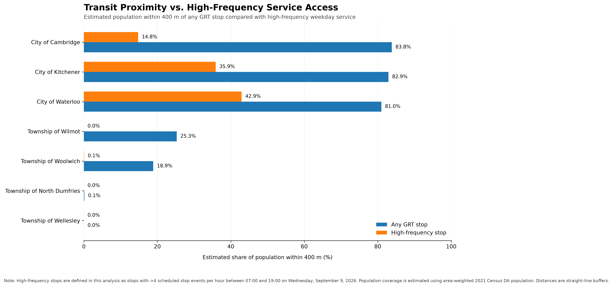
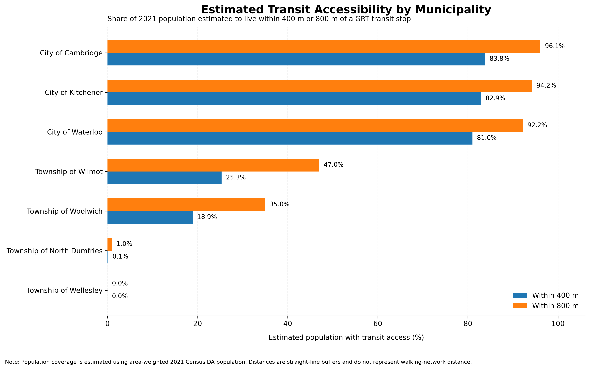
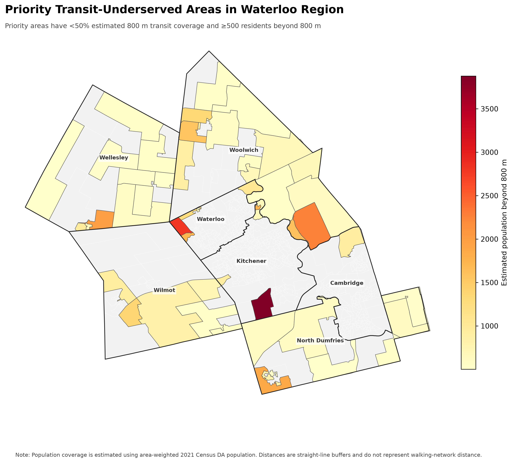
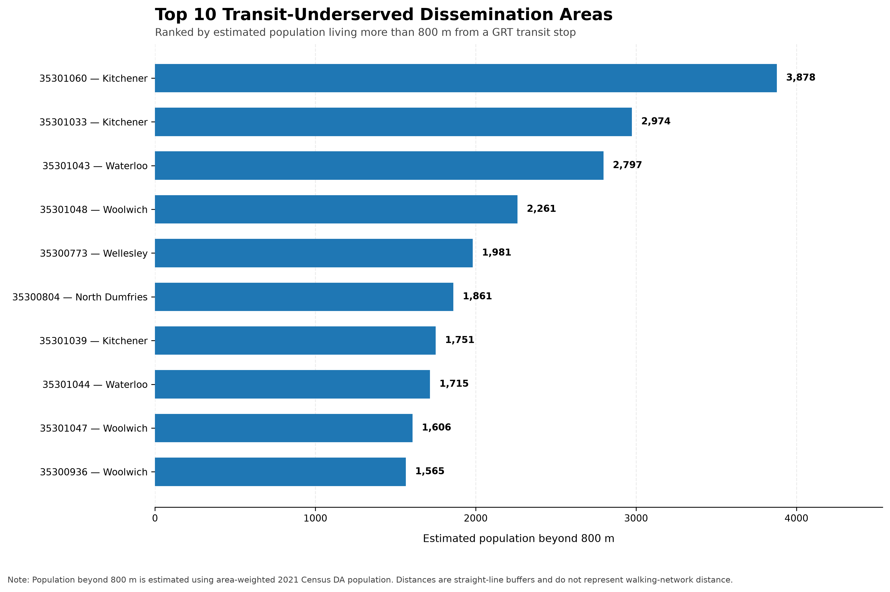

# Waterloo Region Public Transit Accessibility Analysis

## Overview

This project evaluates public transit accessibility across Waterloo Region using Grand River Transit (GRT) GTFS data, 2021 Census population data, and municipal boundary data.

The analysis focuses on two main questions:

1. How many residents live within walking-distance proxies of existing GRT stops?
2. How does access to frequent weekday transit service differ across municipalities?

The project combines geospatial analysis, GTFS schedule processing, Census population estimation, and data visualization using Python.

---

## Key Findings

- Approximately **74.6%** of Waterloo Region residents are estimated to live within **400 m** of a GRT stop.
- Approximately **86.3%** are estimated to live within **800 m** of a GRT stop.
- Approximately **13.7%** are estimated to live more than **800 m** from a GRT stop.
- **52 dissemination areas** were identified as priority underserved areas using the following criteria:
  - less than 50% estimated population coverage within 800 m of transit
  - at least 500 estimated residents living beyond 800 m
- These priority areas contain an estimated **49,712 residents** living beyond 800 m of transit.
- Only approximately **28.1%** of the regional population is estimated to live within 400 m of a stop classified as high-frequency under this analysis.
- Among the three cities:
  - Cambridge has the highest estimated 400 m proximity to any transit stop at **83.8%**
  - Waterloo has the highest estimated access to high-frequency service at **42.9%**
  - Kitchener has approximately **35.9%** high-frequency access
  - Cambridge has approximately **14.8%** high-frequency access

These results show that physical proximity to transit does not necessarily mean access to frequent service.

---

## Data Sources

### Grand River Transit (GRT)

GRT static GTFS data was used to obtain:

- transit stop locations
- route information
- trip schedules
- stop times
- service calendar information

### Statistics Canada

2021 Census dissemination area data was used for:

- dissemination area boundaries
- population counts

The analysis contains **766 dissemination areas** representing a total 2021 Census population of **587,165** in Waterloo Region.

### Region of Waterloo

Municipal boundary data was used to compare transit accessibility across:

- City of Cambridge
- City of Kitchener
- City of Waterloo
- Township of Wilmot
- Township of Woolwich
- Township of North Dumfries
- Township of Wellesley

---

## Methodology

### Transit Proximity

Transit stops were projected to **EPSG:26917 (NAD83 / UTM Zone 17N)** so that distance calculations could be performed in metres.

Two Euclidean buffer distances were created around GRT stops:

- **400 m**
- **800 m**

Overlapping stop buffers were dissolved to avoid double-counting overlapping service areas.

The resulting transit coverage areas were intersected with Census dissemination areas.

Population within each transit coverage area was estimated using area weighting:

```text
Estimated covered population
=
DA population × (intersection area / total DA area)
```

This method assumes that population is uniformly distributed within each dissemination area.

---

## Priority Underserved Areas

A dissemination area was classified as a priority underserved area if:

```text
Estimated 800 m transit coverage < 50%
AND
Estimated population beyond 800 m >= 500
```

Using this definition, **52 dissemination areas** were identified as priority underserved areas.

Together, these areas contain an estimated **49,712 residents** living beyond 800 m of transit.

---

## Service Frequency Analysis

GTFS schedule data was used to extend the proximity analysis by measuring weekday daytime service intensity.

A representative weekday was selected:

**Wednesday, September 9, 2026**

Daytime service was defined as:

```text
07:00 <= scheduled stop time < 19:00
```

Scheduled stop events were counted for each transit stop during this 12-hour period and converted to:

```text
scheduled stop events per hour
```

Stops were classified using analysis-specific thresholds:

```text
Low:       < 2 events/hour
Moderate:  2 to 4 events/hour
High:      > 4 events/hour
```

These categories were created specifically for this analysis and are **not official GRT service classifications**.

Approximately **28.1%** of Waterloo Region residents are estimated to live within 400 m of a high-frequency stop under this definition.

---

## Municipality Comparison

Estimated population within 400 m of any transit stop compared with population within 400 m of high-frequency service:

| Municipality | Any Stop 400 m | High-Frequency 400 m |
|---|---:|---:|
| Cambridge | 83.8% | 14.8% |
| Kitchener | 82.9% | 35.9% |
| Waterloo | 81.0% | 42.9% |
| Wilmot | 25.3% | 0.0% |
| Woolwich | 18.9% | 0.1% |
| North Dumfries | 0.1% | 0.0% |
| Wellesley | 0.0% | 0.0% |

The comparison highlights an important distinction between **transit proximity** and **service intensity**. For example, Cambridge has the highest estimated 400 m access to any transit stop among the three cities, but substantially lower access to high-frequency service than Waterloo or Kitchener.

---

## Visualizations

### Transit Proximity vs. High-Frequency Service



### Municipality Transit Accessibility



### Priority Underserved Areas



### Top 10 Underserved Dissemination Areas



---

## Project Structure

```text
Waterloo-transit-accessibility/
│
├── data/
│   ├── processed/
│   └── raw/
│
├── figures/
│
├── notebooks/
│   ├── 00_environment_test.ipynb
│   ├── 01_gtfs_exploration.ipynb
│   ├── 02_boundary_exploration.ipynb
│   ├── 03_census_exploration.ipynb
│   ├── 04_transit_accessibility.ipynb
│   ├── 05_visualization.ipynb
│   └── 06_service_frequency.ipynb
│
├── src/
├── .gitignore
├── requirements.txt
└── README.md
```

---

## Technologies Used

- Python
- pandas
- GeoPandas
- NumPy
- Matplotlib
- Shapely
- PyProj
- Jupyter Notebook
- GTFS
- GIS spatial analysis

---

## Limitations

Several limitations should be considered when interpreting the results.

First, the 400 m and 800 m accessibility areas are **straight-line Euclidean buffers**. They do not account for actual street networks, sidewalks, pedestrian crossings, physical barriers, or walking routes.

Second, population coverage is estimated using **area weighting**. This assumes that population is uniformly distributed within each dissemination area, which may not reflect the actual distribution of residents.

Third, service frequency is based on **scheduled GTFS stop events**, rather than observed vehicle arrivals, reliability, delays, or passenger wait times.

Fourth, scheduled stop events across multiple routes and directions should not be interpreted as the effective service headway to a particular destination.

Fifth, the high-frequency threshold of more than four scheduled stop events per hour is an **analysis-specific definition** and is not an official GRT designation.

Finally, the population baseline comes from the **2021 Census**, while the transit service analysis reflects the **September 2026 GTFS schedule**. The analysis therefore combines population and transit datasets from different time periods.

---

## Reproducibility

Install the required Python packages using:

```bash
pip install -r requirements.txt
```

Run the notebooks in the following order:

```text
00_environment_test.ipynb
01_gtfs_exploration.ipynb
02_boundary_exploration.ipynb
03_census_exploration.ipynb
04_transit_accessibility.ipynb
05_visualization.ipynb
06_service_frequency.ipynb
```

Raw external datasets are excluded from the repository and should be obtained from their original sources.

---

## Author

**Junho Lee**  
University of Waterloo